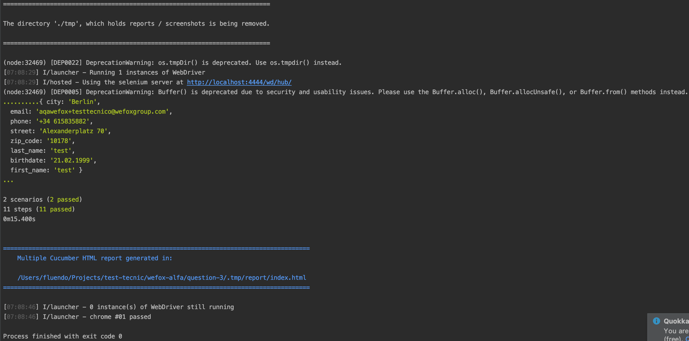
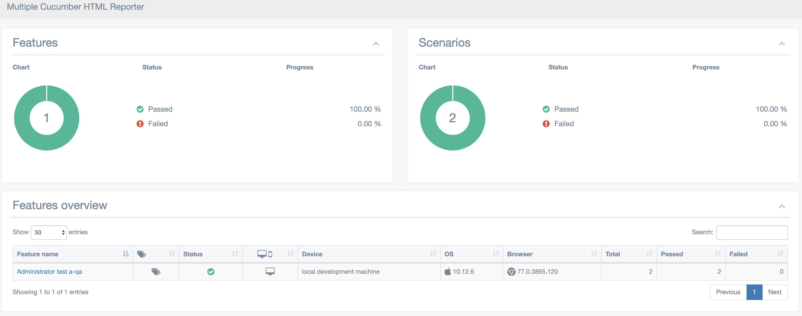
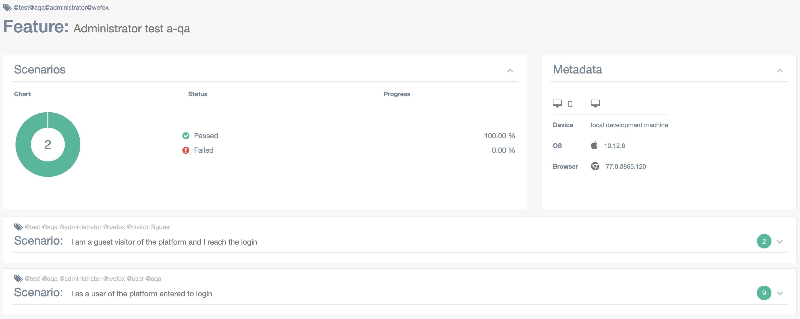
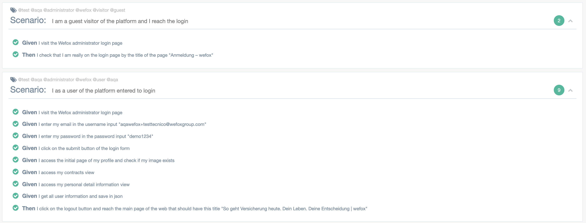

## Question 3

##### Description

In question 3, it was requested to perform automated tests with protractor and selenium. 
To complete this I have also decided to implement Gherkin and cucumber as visual administrator of the tests performed.

###### Run

In a terminal you have to run selenium so that protractor can run 
`npm run selenium`

In another terminal we will run the e2e test 
`npm run e2e`

At the moment the second command is executed a chrome window will open that will execute all the tests.

At the end of this process it will show something like that in console

If we follow the link that tells us we will find some reports made with cucumber

Here we can visually see each test performed and the state in which it was executed, in case of an error it can also be viewed in more detail from here
